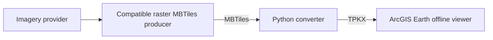

# Watch the result, then understand the system

## Public demonstration

**[Google Maps OFFLINE - The Impossible Is Now Possible!](https://www.youtube.com/watch?v=8uziJNzan1g)**

[](https://www.youtube.com/watch?v=8uziJNzan1g)

The demonstration compares familiar online Street and Hybrid map displays with independently prepared offline imagery viewed in ArcGIS Earth. It illustrates a **map-display** experience, not a duplicate of Google Maps search, routing, Street View or other online services.

## Beginner tutorial

**[How to Make an Offline Map with QGIS and ArcGIS Earth](https://www.youtube.com/watch?v=C71n8TAByuE)**

[](https://www.youtube.com/watch?v=C71n8TAByuE)

This video follows the actual basic production route: QGIS creates raster MBTiles, the Python converter turns the file into TPKX, and ArcGIS Earth opens the finished offline map.

## Large-area Master 4 production video

**[Watch the Master 4 Grid Maker video](https://www.youtube.com/watch?v=zNt-I4KgAy8)**

[](https://www.youtube.com/watch?v=zNt-I4KgAy8)

This one-take video starts with an empty 1-degree area and follows the chain through Master 4, QGIS batch production, MBTiles, TPKX conversion and final ArcGIS Earth viewing.

## Master 4 v3: make the stored zoom levels visible


Master 4 v3 can optionally manufacture a synthetic **Cell 55 Z10-Z20 TPKX** after the standard grid and extent files are complete.

The prompt is:

```text
Create Cell 55 colored zoom-demo TPKX (Z10-Z20)? [y/N]:
```

**No is the default.** Press Enter or type N to skip it. Type Y/Yes only when you want the demonstration/reference package.

Each stored zoom uses a different color and a large Z-number. The project owner generated the v3 package on Windows and opened it in ArcGIS Earth, visually confirming multiple stored-level transitions including Z12, Z13, Z14, Z15, Z17 and Z20.

## Why this changes the teaching flow

A new user no longer has to complete QGIS production before getting a successful TPKX experience.

They can:

1. run Master 4;
2. optionally generate the colored Cell 55 package;
3. double-click/open it in ArcGIS Earth;
4. see a real multiresolution TPKX immediately;
5. watch the Z-number change as ArcGIS Earth selects stored zoom levels; and
6. then move on to QGIS knowing the destination format/viewer already works.

A useful line for the workflow is:

> **Before you make a real map, prove the grid.**

## ArcGIS Earth operating flow for the follow-up video

A practical field/library sequence is:

```text
Area-wide Z17 overview map(s)
        |
        v
Turn on Master 4 grid overlay when needed
        |
        v
Choose the numbered cell(s) covering the area of interest
        |
        +--> Optional Cell 55 Z10-Z20 TPKX sanity/reference check
        |
        v
QGIS production for only the needed high-resolution cells
        |
        v
MBTiles -> TPKX -> ArcGIS Earth
```

The Z17 map gives broad context. The grid answers **where** the detailed map belongs. The high-resolution TPKX cells provide detail.

## Offline reference use

When the online basemap is unavailable, ArcGIS Earth can lose familiar visual context. The local synthetic TPKX gives the operator a known home-grid anchor and visible Z10-Z20 zoom awareness again. That makes it useful as an **offline reference beacon** in addition to its teaching role.

At coarse zooms, the colored footprint can extend beyond exact Cell 55 because standard XYZ tiles are larger than one 0.1-degree cell. Use the Master 4 GeoTIFF and manifest for exact boundaries.

## Production rule

**Reference overlays ON while planning; reference overlays OFF before production.** If the numbered GeoTIFF is left visible while raster imagery is produced, the grid can be burned into the finished map.

## Four players in normal map production



The synthetic Master 4 color package is different: the project itself manufactures those colored teaching tiles. It does not download commercial imagery and is not a substitute for the real map-production path above.

[Return to README](README.md) · [Master 4 guide](MASTER4_GRID_MAKER.md) · [Operator manual](Master4_Grid_Maker_User_Manual.pdf) · [Technical record](TECHNICAL.md)
