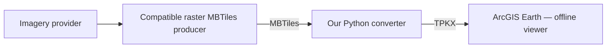

# Watch the result, then make your own map

## The public demonstration

**[Google Maps OFFLINE — The Impossible Is Now Possible!](https://www.youtube.com/watch?v=8uziJNzan1g)**

The demonstration compares familiar online Street and Hybrid map displays with independently prepared offline imagery viewed in **ArcGIS Earth**, and uses colored tiles to show how stored imagery can change by zoom level. It illustrates a **map-display** experience, not a duplicate of Google Maps' search, routing, Street View or online services.

## The four players

**1. Source imagery.** Choose an imagery provider and obtain the permissions required for your particular acquisition, caching, conversion, offline use, display and distribution. This project does not fetch or authorize any provider's imagery.

**2. Produce MBTiles.** QGIS's **Generate XYZ Tiles (MBTiles)** is the project's example route. Other producers can also work if their output meets the converter's supported raster MBTiles requirements. For photographic sources, JPEG/75 can greatly reduce the size of some MBTiles datasets; check legibility and visual fidelity for the source actually used.

**3. Convert with Python.** Download this project's `mb2tpkx.py` and `mb2tpkx.bat` as described in [README.md](README.md). The converter preserves input PNG/JPEG tile bytes and constructs native indexed TPKX bundles. It does not independently reproduce a map service's live rendering engine.

**4. View offline.** Open the resulting TPKX in ArcGIS Earth. The video illustrates locally stored zoom-specific cartography. Actual availability of GPS positioning, terrain profiles and other application features depends on the particular device and separately configured datasets.

## The colored-tile explanation

The synthetic demonstration is deliberately **not** commercial map imagery. Each stored zoom level has different colors and large level numbers. When the viewer switches between those levels, the change becomes obvious. The original test package was constructed for the Jacksonville experiment and was opened successfully by the project owner in ArcGIS Earth.

The source content must genuinely include different tiles at those zooms for the resulting map to reproduce different labels and other cartographic states. The converter **does not create the differences**: it preserves the tiles that the map maker supplied.

## Next: a beginner map-making tutorial

The proposed follow-up starts with a modest on-screen geographic extent in QGIS, produces one compatible raster MBTiles file, converts it to TPKX, and opens it in ArcGIS Earth. Systematic district-scale production and complex geographic splitting are advanced topics, not prerequisites to making a first map.

[Return to the converter](README.md) · [Full technical record](TECHNICAL.md) · [Source-data rights and attribution](LEGAL.md)
