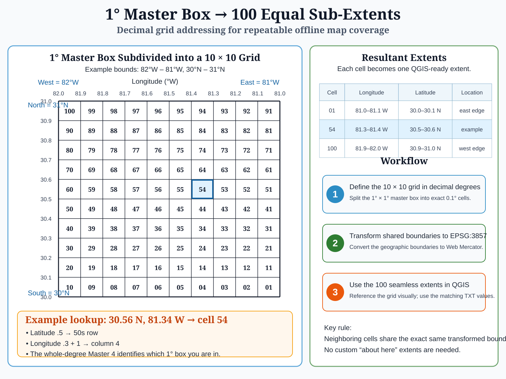
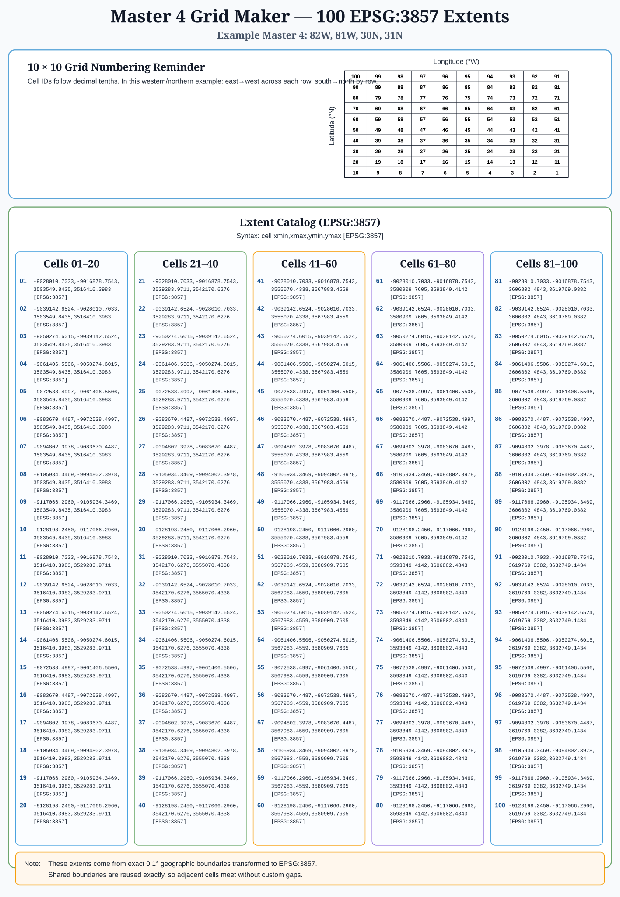

# MBTiles → TPKX: offline maps for ArcGIS Earth

**Make a native offline ArcGIS Earth map from an existing raster MBTiles file—without ArcGIS Pro or an intermediate GeoTIFF.** Bring MBTiles from QGIS or another compatible producer; the converter preserves the original map tiles at every recorded zoom level.

## Watch the videos

**[Google Maps OFFLINE — The Impossible Is Now Possible!](https://www.youtube.com/watch?v=8uziJNzan1g)**

[](https://www.youtube.com/watch?v=8uziJNzan1g)

The video shows online Street and Hybrid map navigation over Jacksonville, then an offline demonstration in ArcGIS Earth. The synthetic color-tile sequence makes the separately stored zoom levels visible. **This reproduces the captured map-display experience, not Google's complete application:** search, live traffic, Street View, routing and other online services are not reproduced.

### Make your own offline map — QGIS and ArcGIS Earth tutorial

**[How to Make an Offline Map with QGIS and ArcGIS Earth](https://www.youtube.com/watch?v=C71n8TAByuE)**

[](https://www.youtube.com/watch?v=C71n8TAByuE)

The follow-along Washington, DC video demonstrates the production workflow: create raster MBTiles in QGIS, convert the file to TPKX with this repository's Python tool, and open the map in ArcGIS Earth.

**New here?** [See the four-step visual explanation and video notes](DEMO.md). **Continuing the engineering project?** Start with [CONTINUITY.md](CONTINUITY.md) and the current [technical record](TECHNICAL.md).

## Project illustrations

**The conversion workflow, in four simple steps:**


**The MBTiles → TPKX breakthrough:**


### Understanding how zoomable maps work

**1. A multiresolution raster tile pyramid — one geographic area at different zoom levels.** Each closer zoom uses more tiles to cover the same territory, revealing progressively finer map detail.


**2. Combining imagery and road-overlay pyramids.** Matching geographic extents and zoom levels let road lines and labels appear over satellite imagery, creating a hybrid map view.


**3. Layer order matters.** Put the road overlay above the imagery: reversing their order can hide the roads and labels.


These diagrams explain tile pyramids and map-layer compositing. They do **not** imply that this converter merges separate imagery and overlay MBTiles files; combined views can be rendered upstream when creating the input MBTiles.

The illustrations explain the workflow; neither the converter nor this repository includes or grants rights to third-party map imagery. See [DEMO.md](DEMO.md) for a beginner-oriented explanation.

## Master 4 Grid Maker — repeatable map extents worldwide

**[Download Master4_Grid_Maker.zip](Master4_Grid_Maker.zip)** · [Full guide](MASTER4_GRID_MAKER.md)

The **Master 4 Grid Maker** standardizes where offline maps begin and end. Enter one whole-degree 1° × 1° master box:

```text
82w, 81w, 30n, 31n
```

The input order is **west, east, south, north**. The tool divides that master into **100 fixed 0.1° × 0.1° cells**, numbered 01–100, then writes two matching files to `C:\downloads`:

```text
Master4_82W_81W_30N_31N_Extents.txt
Master4_82W_81W_30N_31N_Grid.tif
```

The TXT contains 100 **QGIS-ready EPSG:3857 extents**. The GeoTIFF is the matching numbered **EPSG:3857 reference overlay** with a NoData background, so a user can see the cell numbers directly over imagery in QGIS or ArcGIS Earth.

The numbering is hemisphere-aware. The first decimal digit of absolute latitude gives the tens row; the first decimal digit of absolute longitude plus one gives the column. Thus `30.56N, 81.34W`, `30.56N, 10.34E`, `30.56S, 81.34W`, and `30.56S, 10.34E` all identify **cell 54**.





The current build was programmatically tested in all four hemisphere combinations, across the equator and prime meridian, at ±180° longitude, and near the practical Web Mercator latitude limits. Valid tests generated exactly 100 extents plus a 5000 × 5000 EPSG:3857 GeoTIFF; tested malformed/out-of-range inputs were rejected. The project owner also verified generated overlays in **QGIS** and **ArcGIS Earth**.

The system is worldwide **within the practical latitude range of EPSG:3857 / Web Mercator**; the poles are outside that projection. Physical cell area changes with latitude, but the geographic address remains the same 0.1° × 0.1° pattern.

## Four steps, from imagery to offline map

1. **Choose an imagery source** appropriate for your purpose, with the necessary rights for your intended use.
2. **Create raster MBTiles.** QGIS is one example; the converter does not require QGIS specifically.
3. **Convert MBTiles → TPKX** with the included Python program. It copies the original PNG/JPEG image tiles without re-encoding or rebuilding the zoom pyramid.
4. **Open the TPKX in ArcGIS Earth** and navigate the captured map offline.


## Download and use

### First-time Windows setup

1. **Install Python 3:** [Official Python downloads for Windows](https://www.python.org/downloads/windows/). Make sure the `py` command works in Command Prompt. Confirm the version with `py -3 --version`.
2. **Install the only additional Python library, [Pillow](https://pillow.readthedocs.io/):** open Command Prompt and run:

   ```powershell
   py -3 -m pip install Pillow
   ```

   If the result says **"Requirement already satisfied,"** Pillow is already installed; you do not need to reinstall it.
3. **Download the converter:** [Download this repository as a ZIP](https://github.com/Jim-dc95811/QGIS-Mbtile-to-ArcGIS-Earth-TPKX/archive/refs/heads/main.zip). Extract `mb2tpkx.py` and `mb2tpkx.bat` into the **same folder**.

**Owner's confirmed Windows installation (2026-09-29):** `py -3 --version` reports **Python 3.14.5**, and `py -3 -m pip install Pillow` reports **Pillow 12.3.0 already installed**. These are the versions shown by the owner's Command Prompt, not minimum requirements or proof of compatibility testing across versions. Pip's displayed cache warnings did not prevent it from recognizing Pillow as installed.

**Run it on Windows:** Drag your existing `.mbtiles` file onto `mb2tpkx.bat`, or double-click the BAT and paste the source path when prompted.

**Command line (optional):**

```powershell
py -3 mb2tpkx.py "input.mbtiles" "output.tpkx"
```

The source file is retained. Output is created alongside it unless you specify another location, and **an existing output is not overwritten**. Allow additional disk space and time for large datasets. Open the finished `.tpkx` with ArcGIS Earth. This is a Python CLI with a Windows launcher, not a GUI program.

## Real-world results

The project owner has supplied Windows Explorer screenshots and tested the converted packages interactively in ArcGIS Earth. These are **reported field tests**, not universal performance or quality guarantees.

| Example | Source MBTiles (Windows-displayed KB) | Resulting TPKX (KB) | Reported observation |
| --- | ---: | ---: | --- |
| First large real-data test | 4,137,400 | 4,108,022 | Loaded and navigated correctly |
| Z20 PNG grid, Master 3-1 | 39,891,100 | 39,587,335 | Responsive viewing of a roughly 40 GB-class package |
| Z20 JPEG/75 grid, Master 3-2 | 4,354,360 | 4,090,206 | Clear zoom-dependent hybrid cartography in the tested locations |
| Jacksonville Metro Z20, JPEG/75 | 21,786,032 | 20,629,591 | Large single-file metropolitan hybrid map loaded in ArcGIS Earth |

**JPEG/75 is chosen while producing MBTiles, not in the converter.** The two Master grid runs are different grids, so their substantial size difference is useful production evidence, **not** a controlled identical-source image-quality or compression benchmark. Hybrid and Street map imagery compress differently. Details and remaining test limitations are in [TECHNICAL.md](TECHNICAL.md).

## A human–AI engineering collaboration

This project was conceived, directed, developed through hands-on experiments, and field-tested by **Jim Gaddy**, working with **OpenAI's ChatGPT** as an AI coding and documentation partner. The converter emerged through that iterative collaboration: Jim supplied the problem, technical direction, reference tests and real-world acceptance testing, while ChatGPT helped produce and refine the implementation and written materials.

**This is Jim's project to publish, not code taken from an AI assistant without permission.** Under [OpenAI's Terms of Use](https://openai.com/policies/terms-of-use/), as between the user and OpenAI and to the extent permitted by applicable law, the user owns the generated output; OpenAI assigns any rights it may have in that output. No separate permission from ChatGPT is needed to publish it. Jim has published the project's software under the [MIT License](LICENSE). This acknowledgment is not a claim of OpenAI sponsorship or endorsement, nor does it override any independent rights in third-party code or map imagery.

## What it supports

- **Input:** existing standard Web Mercator **raster** MBTiles with 256 × 256 PNG/JPEG image tiles using the TMS row convention; the implemented tiling scheme covers levels 0–23. It does **not** convert vector MBTiles, arbitrary projections or every unconventional MBTiles layout.
- **Output:** Esri Compact Cache V2 TPKX, containing indexed 128 × 128 tile bundles and the captured input zoom levels.
- **Image handling:** map tile bytes are copied unchanged. A separate presentation thumbnail is derived from a source tile. The converter does not download imagery, create new cartography, invent missing zooms or recompress the tiles.
- **Testing:** a multi-bundle synthetic color package was accepted by both ArcGIS Earth and ArcGIS Pro; real-data output from the distributed script has been field-tested extensively in ArcGIS Earth. See [TECHNICAL.md](TECHNICAL.md) for known limitations.

## Documentation and project status

- [DEMO.md](DEMO.md) — video and nontechnical four-step workflow.
- [MASTER4_GRID_MAKER.md](MASTER4_GRID_MAKER.md) — Master 4 Grid Maker operation, numbering, validation and global Web Mercator scope.
- [CONTINUITY.md](CONTINUITY.md) — how to resume this project and locate the authoritative files.
- [TECHNICAL.md](TECHNICAL.md) — precise format behavior, reproducibility and test history.
- [RELEASE_CHECKLIST.md](RELEASE_CHECKLIST.md) — testing and public-release review.
- [CREDITS.md](CREDITS.md) — upstream specifications, dependencies and acknowledgments.
- [LEGAL.md](LEGAL.md) — imagery-provider rights, attribution, trademarks and intended-use limits.
- [CONTRIBUTING.md](CONTRIBUTING.md) / [SECURITY.md](SECURITY.md) — project participation and reporting.
- [LICENSE](LICENSE) — **MIT License**, copyright © 2026 Jim Gaddy. You may use, copy, modify and redistribute the project software under the license terms; preserve the required notice. [LICENSE_STATUS.md](LICENSE_STATUS.md) records its status and separate imagery-rights limits.

### Formats and attribution

The converter connects two documented formats: [Mapbox MBTiles](https://github.com/mapbox/mbtiles-spec) and Esri's published [Compact Cache V2](https://github.com/Esri/raster-tiles-compactcache) / [TPKX specification](https://github.com/Esri/tile-package-spec). Format specifications do not grant rights to third-party imagery. **Use only source imagery you are authorized to acquire, retain, convert and display for your intended purpose.** The current converter does not automatically propagate separate MBTiles attribution fields; users must meet each provider's credit requirements. No commercial imagery or proprietary example TPKX packages are distributed in this repository.

Independent project; **not affiliated with or endorsed by** Google, QGIS, Esri or Mapbox. Actual offline coverage, currency, accuracy, device operation and necessary permissions should be checked before any operational use.
